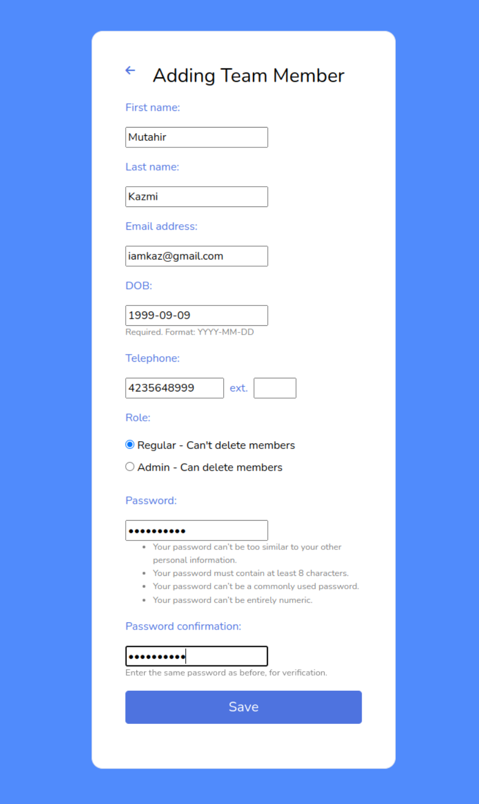
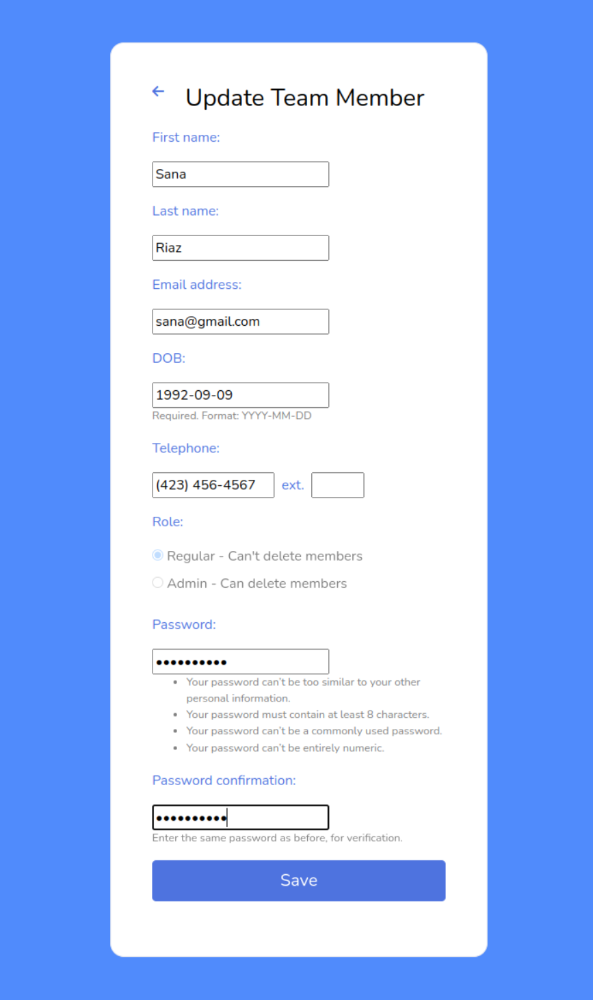

# Full-stack-take-home-assignment

## Space Setup

Clone Repository
```
  git clone https://github.com/zunerazaidi/Full-stack-take-home-assignment.git
```

Setup environment on Ubuntu:

- Check version of Python using
```
python3 -V
```
- Create Virtual Environment using 
```
python3 -m venv djangoenv
```
- Activated it by using:
```
source djangoenv/bin/activate
```
- For installation:
```
pip install -r requirements.txt
```
- Migration commands:
```
python manage.py makemigrations
python manage.py migrate
```
```
python manage.py collectstatic
```
- Create SuperUser:
```
python manage.py createsuperuser
```
Note: If you selected Role: Admin as a superuser, you will be able to add Regular members in application but if you selected Role: Regular, you won't be able to add new members in application.

- Testing a Server:
```
python3 manage.py runserver        ---> Success
```
## Steps to execute application: 
### Login Page:
  This page requires user to enter email address and password.

  

### Team Member List: 
  This page list down all members present in the team. There are 2 roles for this page:

**Admin:**
  If login user is Admin then (+) sign is visible in the page. Through this sign, admin can add new member in the team. Admin can update information of himself and any team member by clicking the name. 

  

**Regular User:**
  Regular User does not have any rights to add new member in the team nor to update any team member information except for himself.

  

### Add Team Member:
  Only Admin is authorized to open this page by clicking (+) sign to add new team member.

  

### Edit Information of Team Member:

**Admin:**
  Admin can edit his own and any team member information.

  

**Regular User:**
  Regular user can only edit his own information.
  
  

### Delete Team Member:

**Admin:**
  Admin is authorized to delete any team member from a team. If login user is the same Admin then he is not authorized to delete his own data. Delete button on the Edit user page is visible.

  

  

**Regular User:**
  Regular user is not authorized to delete any member from a team. Delete button on Edit user page is not visible.

  
  
Note: When any unauthorized user tries to open any page, it gives unauthorized error.

  

## Flow for Application

### Admin:

- First page is Login Page, enter email and password you set for superuser. If you enter wrong details it won't proceed to Member list page but if you enter right details it will proceed to Member list page.
- Because you register only one member which is superuser, you will be able to see only 1 Member in the list. 
- Now add another member by clicking "+" symbol on page. Add Member information and Save it.
- The application will redirect to Member list page and you can see that now there are 2 Members in list.
- If Admin wants to delete any member, click on the specific user name and delete the member by clicking delete button. Admin will redirect to member list page and you can see that deleted member is no longer available in the team member list.
- If Admin wants to change its information, he/she can click on the name and the edit page will open. On save button, information will be save and the page will be redirect to the login page but if admin wants to change any other team member, after clicking on save button, the page will be redirect to the member list page. 
- On clicking logout button, admin will logout from the application.

### Regular User:

- On login page, regular user will add email and password added by the Admin. By entering right credentials, Member list page open where list of all team members are displayed. You can see there is no "+" symbol on page because Regular user is not authorized to add any new member.
- Regular user can change his/her information by clicking own name, edit new information and click on save button. 
- After saving, user will redirect to login page.
- On clicking logout button, user will be logout from the session.

## Future Plans:

- Forgot Password functionality, in which user will get an email to reset the password.
- User will be able to upload picture in add/update page
- Detailed messages like User is logged in, user is logged out etc
- And so much more.